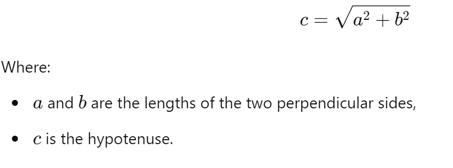

# Lab 1 - Python Modules and Functions

1. Create a module (a python file ending in .py) called `hypotenuse.py` in the lab1 folder.
2. Write a function `calculate_hypotenuse()` that given two attributes (the lengths of two sides of a right angled triangle) calculates the length of the hypotenuse. 
3. Write a calculator in `driver.py` that implements the my_sum(), my_multiply(), my_divide() and my_subtract() functions. Query the user for 2 values and present them with a menu of operators. Evaluate the result and print it out.
4. Commit and push your changes to your repository.

# Marking Scheme

1. (2 point) Correctly use git/GitHub and the repository so I can grade your solution
1. (2 point) Correctly format and comment your code. Don't miss the doc strings.

1. (1 point) Have a working menu
1. (1 point) Hypotenuse functionality works
1. (1 point) Sum functionality works
1. (1 point) Multiply functionality works
1. (1 point) Divide functionality works
1. (1 point) Subtract functionality works
