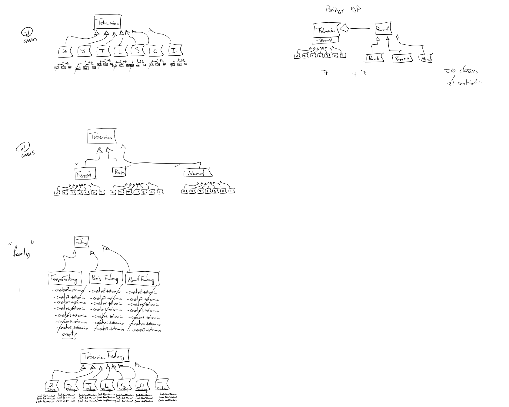

# Assignment 2: Abstract Factory Design Pattern with Tetris Game

## Part 1 - Build a Tetris Game

**Objective:** To implement Tetris game using Pygame.

**Tutorial and Demo:**

- <https://youtu.be/vHVhLUE8utY>

**Development Strategy:**

1. Install Pygame
2. Setup the Game Loop:

   - Create a basic Pygame window.
   - Implement a game loop that handles events, updates game logic, and renders graphics.

3. Creating the Grid:

   - Design a data structure to represent the Tetris grid (e.g., `2D list` or `dict`).
   - Visually draw the grid on the Pygame window.

4. Create Tetrominoes:

   - Define different Tetromino shapes (I, O, T, J, L, S, Z) using their block configurations in [Tetrominos.pdf](Tetrominos.pdf)
   - Implement a way to randomly select a Tetromino at the start of each turn.

5. Move Tetrominoes:

   - Allow user input to control Tetromino movement:
     - Left and right
     - Down (soft drop)
   - Ensure Tetrominoes stay within grid boundaries.

6. Rotate Tetrominoes:

   - Allow user input to rotate Tetrominoes.
   - Prevent rotations that would place Tetrominoes outside the grid.

7. Checking for Collisions:

   - Implement gravity: Tetrominoes fall automatically over time.
   - When a Tetromino reaches the bottom or collides with another Tetromino:
     - "Lock" the Tetromino in place.

8. Check for Completed Rows:

   - After each Tetromino locks, scan for full horizontal rows.
   - Clear completed rows, and shift all rows above them down.

9. Implement the Game Over logic:

   - Detect when a new Tetromino cannot be placed at its starting position.
   - End the game and display a "Game Over" message.

10. Create User Interface:

    - Display a "Next Block" preview area.
    - Display the current score.

11. Add Score:

    - Award points for clearing lines:
      - 1 line: 100 points
      - 2 lines: 300 points
      - 3 lines: 500 points
    - Award a small number of points for each Tetromino's downward movement (soft drop).

12. Add Next Block
    - Display a preview of the upcoming Tetromino shape.

## Part II: Power-ups and Design Patterns

**Objective:** To add power-up Tetrominoes and use the abstract factory design pattern to manage their creation.

**Demo:**

- <https://youtu.be/bwUZdRFmmOo>

**Instructions:**
Add power ups to your Tetris game. Power-ups are special Tetrominoes that provide unique effects when activated. You will implement two types of power-ups: **Freezed Tetromino** and **Bomb Block Tetromino**. Update your game logic to randomly include power-up Tetrominoes based on a predefined probability.

1. Add **Freezed Tetromino**: a type of Tetromino that slows down the game's speed temporarily. The Freezed Tetromino induces a temporary state where the normal flow of the game slows down or pauses for a predefined duration. Effect Duration is customizable.

   - Each Freezed Tetromino has a unique brightened color to indicate it's in freezing state.
   - Implement the effect of this Tetromino:
     - When activated, temporarily slow down the game's speed (i.e., the falling speed of all Tetrominoes) for a set duration.
     - Each Tetromino can have a **customizable** freeze duration.
   - For testing, this power-up should also be activated by the player (e.g. by pressing a specific key).

2. Add **Bomb Block Tetromino**: a type of Tetromino that triggers an explosion when it locks into place. This effect can clear surrounding blocks or lines, creating space for the player to continue building and preventing the game board from becoming too crowded.

   - Each Bomb Tetromino has a unique darkened color to indicate it's a bomb.
   - Each Bomb Tetromino has a unique explosion pattern and **customizable** range.
     - Implement the effect of this Tetromino: When it locks into place, trigger an explosion that clears surrounding blocks or lines within a customizable radius.
   - For testing, this power-up should also be activated by the player (e.g. by pressing a specific key).

3. Add the needed factory classes using the _Abstract Factory_ design pattern.

**Integration:**

1. Identify your Product Families and Variations. This is key to getting the Abstract Factory Pattern down.
2. Draw the Product Hierarchies and the Factory Hierarchies.
3. Identify any other classes and objects you will need. Figure out what each class is responsible for.
4. Draw a UML class diagram showing how the classes/objects relate to each other. Write down the attributes and methods. At this stage you can do a simple sketch on paper. Don't worry about syntax and only mention the important attributes/methods.
5. Write some code.
6. Repeat from step 3. (Take an iterative approach!)

**Considerations:**

- **Balance:** Ensure the power-ups are fun additions without making the game too easy.
- **Visuals:** Consider adding visual effects to indicate the Freeze and Bomb power-ups, enhancing the gameplay experience. For example, you can use flashing/alternating colors.

<!-- ## Marking Scheme

| Criteria                                              | Points    | Description                                                                                                                                    |
| ----------------------------------------------------- | --------- | ---------------------------------------------------------------------------------------------------------------------------------------------- |
| **Part 1: Build a Tetris Game (50 points)**           |           |                                                                                                                                                |
| Core Game Mechanics                                   | 30        | Grid representation (5); Tetromino shapes & generation (5); Movement with boundary checks (5); Rotation (5); Collision detection & locking (5) |
| Line Clearing & Game Over                             | 10        | Detecting full rows (2); Clearing rows & shifting blocks (3), Game over logic (5)                                                              |
| User Interface & Scoring                              | 10        | Next block preview (2); Score display (3); Scoring system (5)                                                                                  |
| **Part 2: Power-ups and Design Patterns (40 points)** |           |                                                                                                                                                |
| Abstract Factory Implementation                       | 20        | Abstract Factory class(es) (5); Concrete factories (5); Correct pattern usage (40)                                                             |
| Power-up Tetrominoes                                  | 20        | `FreezePowerupTetromino`s (5); `BombBlockTetromino`s (5); Integration (10)                                                                     |
| **Additional Considerations (10 points)**             |           |                                                                                                                                                |
| Code Quality                                          | 5         | Readability, comments, naming conventions                                                                                                      |
| Gameplay and Balance                                  | 5         | Fun factor, difficulty, power-up effectiveness                                                                                                 |
| **Submission/Deliverables**                           |           |                                                                                                                                                |
| GitHub Classroom Link                                 | Mandatory | Penalty for missing deliverables                                                                                                               |
| YouTube Video                                         | Mandatory | -40% Penalty for missing deliverables                                                                                                          | -->
<!-- 
## Tips

- Work incrementally – test each part as you build it.
- Refer to Pygame documentation and online tutorials for examples.
- Start with the core mechanics, then add the UI and scoring later.
- Start Simple, Then Expand: Begin by implementing the standard Tetromino types and game mechanics. Once that's solid, introduce the abstract factory design pattern and then the power-ups.
- Design Before Coding: Think carefully about the classes you'll need and their relationships _before_ you start writing code. Sketch out class diagrams to help you visualize the abstract factory structure.
- Modularize: Break down your code into well-defined functions and classes as this will aid in adding the power-ups more smoothly.
- Balance the Power-ups: Experiment with different effect durations and explosion ranges and patterns to make sure the power-ups are challenging and fun without being overpowered.
- Visual Feedback is Key: Design clear visual indicators for when power-ups are active (e.g., slowing down the game with a visual effect for Freeze, and a flashy explosion for the Bomb).
- Test, Test, Test: Test each feature thoroughly as you add it. Debug and fix problems early! -->

## Notes
- You must start with my code first before adding the design pattern and power-ups. Please write it from scratch. Do not copy-paste it.
- Do not use multiple inheritance. Some duplicated code is acceptable in this assignment to avoid multiple inheritance.
- Commit your code frequently with meaningful commit messages.
- Avoid using the association relationship. Use composition or aggregation instead.

## Hint
- Since there are seven standard Tetrominoes (I, O, T, J, L, S, Z) and three power-up Tetrominoes (Freezed, Bomb, and Normal), you will end up with 21 concrete classes if you create a separate class for each Tetromino type.
- To reduce the number of classes, consider using composition instead of inheritance. For example, you can create a `Tetromino` class that contains a `PowerUp` attribute. Which Design Pattern is this? This will allow you to create different combinations of Tetromino shapes and power-ups without needing a separate class for each combination. That is, seven shape classes and three power-up classes. 10 classes in total.  

